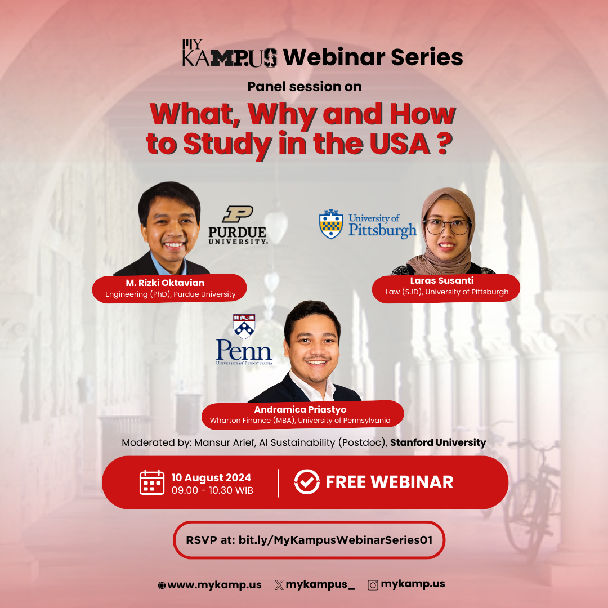

Halo semuanya!

MyKampus dengan bangga mengadakan webinar perdana kami, yang akan membahas **What, Why, and How to Study in the US?** Ini adalah kesempatan yang sempurna bagi Anda yang berminat melanjutkan studi S2 atau S3 di Amerika Serikat! 

Pembicara pada webinar kali ini adalah:
* M. Rizki Oktavian (PhD Nuclear Engineering, Purdue University)
* Laras Susanti (SJD Law, University of Pittsburgh)
* Andramica Priastyo (MBA Finance, University of Pennsylvania)

Yuk, diskusi dengan panelis dan cari tau lebih lanjut tips dan trik memilih kampus, mengirimkan berkas, dan menjadi mahasiswa berprestasi di kampus top di Amerika Serikat.

Kami tunggu kehadiran Anda!

- **Hari:** Sabtu, 10 Agustus 2024, pukul 09.00 - 10.30 WIB
- **Venue:** Online (Zoom)
- **RSVP:** [bit.ly/MyKampusWebinarSeries01](https://www.bit.ly/MyKampusWebinarSeries01)
- [Simpan di Google Kalender](https://calendar.google.com/calendar/u/0/r/eventedit/copy/MTltb29iNnVucWZkbGk5aHVjMmJ0bHJlMDAgYjEyZmI5Mzg2NjQwNmI5NjUxNDRkNjIyNjUzZDc4ZDAyZjhjNDY5OWEwYzJkMjIwYTY0OWFiNjcxNTA5NDI3ZkBn)

